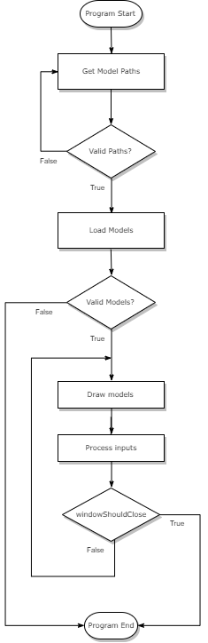
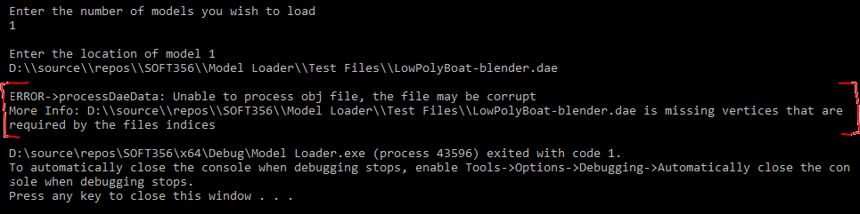

# SOFT356 C1: Model Loader

#### Student No: 10550420 / Jamie Everett

<!-- Which version Visual Studio, OpenGL/Vulkan -->

## Software Used for Development:

<ul>
    <li>Visual Studio 2019</li>
    <li>nupengl.core v0.1.0.1 (NuGet)</li>
    <li>glm v0.9.9.600 (NuGet)</li>
</ul>

<!-- How do I work it? -->

## How To Use the Model Loader:

The model loader accepts two model types, <b>obj/mtl combination</b> and <b>blender dae</b>.
  
When loading an obj file, the loader will look for an mtl file with the same name in the same directory. If one is found, the texture and/or material effects will be applied. If not, a black polygon model will be rendered with no material data.

### Keybindings

The model loader comes with the following controls to provide a satisfying user experience (all bindings are not case sensitive):

<b>Camera Controls:</b>

| Input          | Action                       |
| -------------- | ---------------------------- |
| Mouse Movement | Pitch & Yaw                  |
| Mouse Scroll   | Increase/Decrease zoom (FOV) |
| W              | Camera forward               |
| A              | Camera left                  |
| S              | Camera back                  |
| D              | Camera right                 |
| Left Shift     | Camera up                    |
| Left Control   | Camera down                  |
| Page Up        | Scale models up              |
| Page Down      | Scale models down            |

 
<b>Model Controls:</b>

| Input     | Action                               |
| --------- | ------------------------------------ |
| Backspace | Remove the last model that was added |
| 1         | Toggle wireframe mode                |
| 3         | Swap model textures                  |

 
<b>Window Controls:</b>

| Input  | Action                          |
| ------ | ------------------------------- |
| Escape | Close the program               |
| 2      | Toggle viewport mouse capturing |

 

### Loading Models

<ol>
    <li>When the program is run, a command prompt will open which will ask for the number of models you wish to load. Enter the required amount and press <i>enter</i>.</li>
    <li>Then, enter the file locations for each model as requested.</li>
    <li>The models will then be displayed in a new OpenGL window. Use the above listed keybindings to explore the models.</li>
    <li>When you are finished using the program, press <i>escape</i> to exit.</li>
</ol>

## Code Structure

The code is made up of 6 main cpp files, the main one being <i>ModelLoader.cpp</i>. From this file, the model paths are acquired from <i>getModelPaths(vector\<string\> modelPaths)</i>, passed to the <i>loadModels(vector\<string\> modelPaths, vector\<Model\> models)</i> function and then displayed through <i>display(GLFWwindow\* window, vector\<Model\> models)</i>.

<i>getModelPaths(vector\<string\> modelPaths)</i>
 
Repeatedly asks the user for how many models they wish to load and their respective paths. The function is called again if an error is hit, such as the input for number of models is invalid or a model path cannot be opened.

<i>loadModels(vector\<string\> modelPaths, vector\<Model\> models)</i>
 
Loops over each model path in <i>modelPaths</i> and calls the the model load function for the required filetype. The model load function will then parse the model file data and return a <i>Model</i> object. If a model cannot be loaded, the program exits with an error message and <i>exit(EXIT_FAILURE)</i>.
 
Each model is also assigned a shader object in this method.

<i>display(GLFWwindow\* window, vector\<Model\> models)</i>
 
Loops over each model in <i>models</i> and calls <i>models[i].draw()</i>.
It is also responsible for linking callbacks, handling frame timing (refresh rate), processing inputs (e.g. camera movement) and updating shader uniform values.
 
Most of this function is repeatedly called until <i>Escape</i> is pressed (which sets <i>glfwWindowShouldClose</i> to <i>true</i>).

 
Below is a high-level flow diagram of the program execution logic:
  

    

 
Each <i>Model</i> object is constructed of one or more (potentially many) <i>Mesh</i> objects. The <i>Mesh</i> objects contain both vertex data for position, texture coordinates (UVs) and normals as well as material data such as ambient, diffuse and specular colour. When <i>model.draw()</i> is called, each <i>Mesh</i> is looped over and <i>mesh.draw()</i> called (which is where <i>glDrawArrays()</i> can be found).

 
The <i>Shader.cpp</i> class constructs a <i>Shader</i> object from a vertex and fragment shader filepath. The shader files are compiled and then a shader program is created. The class also contains some useful utility functions, such as quickly equipping shader programs.

## Optimisations and Improvements

I have added some extra features to generally improve the loader, such as corrupt file detection. When attempting to load obj or dae files, a simple integrity check is performed on each mesh before adding it to the model. This prevents files which are missing vertices from crashing the program during mesh processing. If a file with missing vertices is found, a similar error as below will be presented to the user:

 

    

 
I have also created a header file (with include guards) for each cpp file, to prevent duplicate code sections being needlessly recompiled.

## Future Improvements

One main feature I would like to add in the future is the ability to save models in a custom format. To do this I would take the best parts from both obj and dae file formats and aim to create an improved way to store models. I would combine the simplicity of the obj plaintext format with the mesh structuring of the dae XML format. Simply, my file format would look like an obj file with better indicators between where meshes and materials begin and end.
  
I would also like to add support for recursive file loading from a folder input.
  
As my C2 project will build on this Model Loader, I will attempt to implement as many improvements as possible in the next submission.
